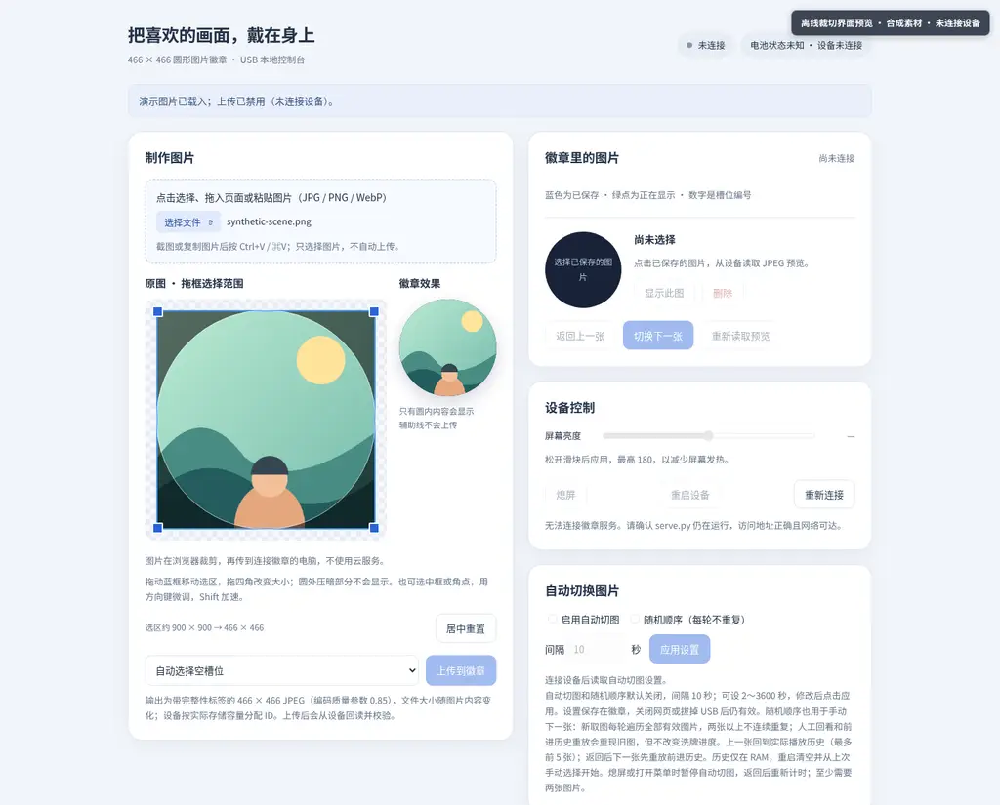

# USB Picture Badge

Firmware and a pure HTTPS Web Serial controller for the Waveshare ESP32-S3-Touch-AMOLED-1.75C. Supported desktop browsers talk directly to the USB serial port; no PWA, Python serial bridge, native helper, or cloud image service is required. The production Pages site is hosted by [electronic-badge-project/electronic-badge](https://github.com/electronic-badge-project/electronic-badge); reviewed content is manually synced from this source repository's `docs/` directory and is not automatically deployed by commits here.

The device's screen-off setting only turns off the display. It does not mean ESP32 deep sleep, power-off, or guaranteed reduction of total device power use.

> The console screenshots show the real web UI with original synthetic artwork, offline and not connected to a device.

[Open the hosted controller](https://electronic-badge-project.github.io/electronic-badge/console/) · [Mobile-size screenshot](docs/assets/console-mobile.webp) · [Chinese primary README](README.md) · [Chinese project introduction](https://electronic-badge-project.github.io/electronic-badge/)

## Features

- Select, drop, or paste JPG, PNG, or WebP, adjust a circular crop, and preview before explicitly uploading. The browser outputs 466×466 JPEG using Canvas `toBlob` quality parameter 0.85; file size varies by image. WebP is decoded in the browser and converted to JPEG. Firmware uses the ESP32-S3 ROM software TJpgDec JPEG decoder and does not decode WebP.
- Browse, replace, delete, display, and read back saved JPEGs; adjust brightness, animation, device menus, slideshow, and screen-off settings. Image transitions include direct, fade, slide, and a low-cost radial ripple whose edge is less soft than a blended transition. Stable image IDs are 0–2147483646; capacity depends on LittleFS space.
- Firmware-managed slideshow continues without the computer service. Shuffle is opt-in. Playback history retains at most six entries in RAM and resets on reboot.
- Separate USB/battery idle screen-off settings and PMU-reported charging status. USB connection alone does not imply charging.
- Image storage and transfer are CRC checked; failed uploads do not replace the prior image.

## Use the HTTPS Web Serial controller

Use a desktop Chromium-family browser or Firefox 151+, a data-capable USB cable, and an OS account with serial-port access. Open <https://electronic-badge-project.github.io/electronic-badge/console/>, click **Connect badge**, and choose the badge in the browser's serial picker. The project does not apply an unverified USB VID/PID filter, so verify the selected device. The page opens it at 115200 baud, reads `STATUS` and the CRC-protected catalog, and enables controls only after that succeeds.

The controller is static HTML/CSS/JavaScript. Cropping, JPEG encoding, exact-length binary framing, and CRC validation happen in the browser; images travel directly to firmware through Web Serial. Uploads follow `READY`, one `ACK` per 4096-byte firmware chunk, and final `OK <slot>`. Downloads consume exactly the length announced by `DATA <length> <crc>`, validate CRC, then validate the separator and final reply.

Serial permission belongs to the **origin (scheme + hostname + port)**, not the repository path. Pages for different repositories under the same `*.github.io` hostname can therefore be same-origin, and same-origin scripts may enumerate previously granted ports. Grant access only to a site you trust; use a dedicated custom subdomain when strict isolation is required. The chooser must be triggered by user action. A single previously granted port is reused only after the user clicks Connect; otherwise the chooser is shown. The page provides explicit disconnect and handles stream cancellation, lock release, physical disconnect, and reboot reconnection.

`docs/console/index.html` is the one controller source and the Pages artifact. `web/index.html` only redirects source-tree users to it, so controller logic is not duplicated. The production Pages repository is separate: publishing requires reviewed manual synchronization of the complete `docs/` tree to `electronic-badge-project/electronic-badge`; this source repository does not auto-deploy it.

## Build and update safely

Requires Git, Python, PlatformIO Core, and network access. The build pins pioarduino `55.03.312-1` and Waveshare vendor source commit `6d19f7e16fb9a3be219e9eed43ca9eb56c88d01c`. Full build and safe-initialization commands are in the Chinese primary README.

Only a confirmed blank, new device may use the initial PlatformIO `upload`, which installs the bootloader, partition table, and application, followed by an empty filesystem `uploadfs`. The root `data/` directory is a host-computer input to the filesystem image builder, not a device directory created by firmware. If absent, create it with `mkdir data`; if already present, inspect and confirm it is empty before skipping that command. If nonempty, stop without deleting or overwriting anything. Never use these initialization steps on an existing device whose data must be preserved.

**v1 stores images as RGB565, which v2 does not read or migrate.** Before upgrading, export images using v1 while that firmware and its tools are still available, verify an offline backup, and convert the images to 466×466 JPEG. Keep the backup until the migrated JPEGs have been imported and verified in v2.

For an existing device, write only the new `firmware.bin` to the APP partition at `0x10000`. Do not use PlatformIO full upload, uploadfs, whole-chip erase, or restore an old full-flash image when device data must be preserved. LittleFS is mounted without automatic formatting; screen-off is not deep sleep or power-off.

## Measured memory and performance

Two RGB565 source frames, two output frames, and one USB/menu working frame use about 2.07 MiB total, plus a separate 4 KiB JPEG workspace (excluding other runtime memory). On 42 saved natural photos, file read, CRC, decode, and RGB conversion took about 228–284 ms per image; direct display-and-ack took 301–356 ms including display. These are observations for that sample, not guarantees or WebP device-decoding results.

## Privacy and AI-assisted deployment

Never share private photos or backups, tokens, private domains, or device serial numbers in public chats, issues, or remote AI services. The controller needs no `.env`, account, or cloud credential. Share only system details and redacted errors. The Chinese primary README includes a copyable prompt for reviewed, non-destructive firmware steps; there is no one-click deployment or flashing from the controller.